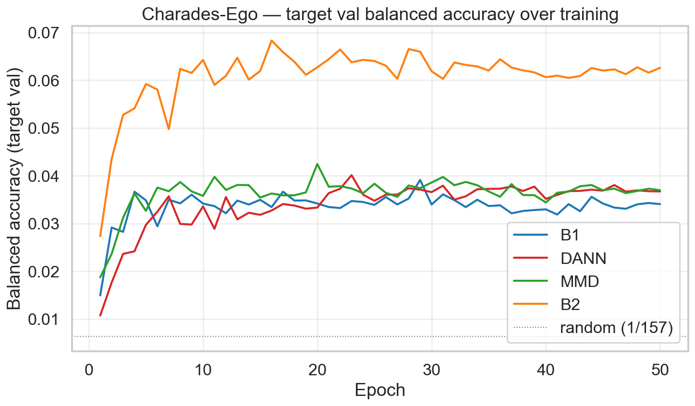
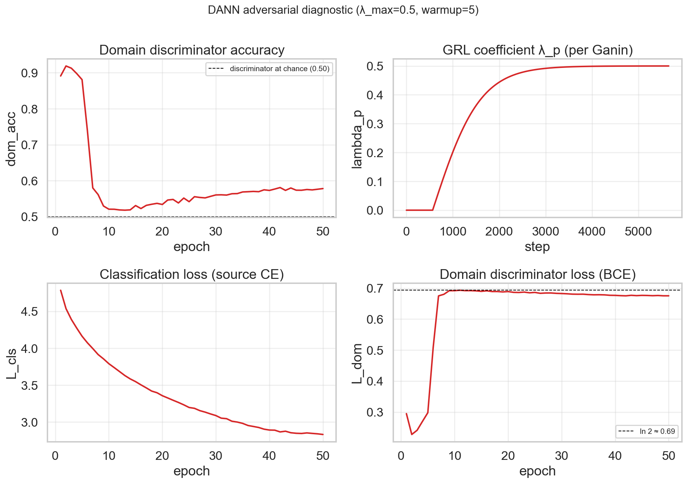
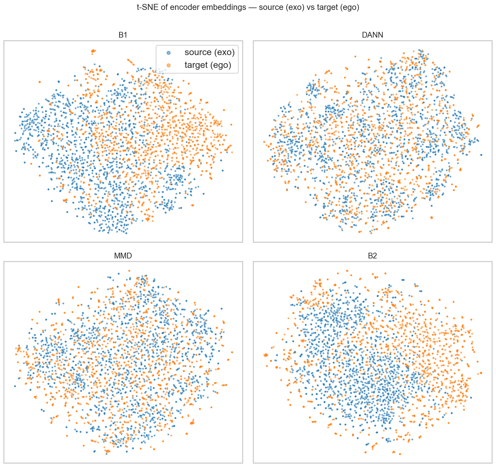
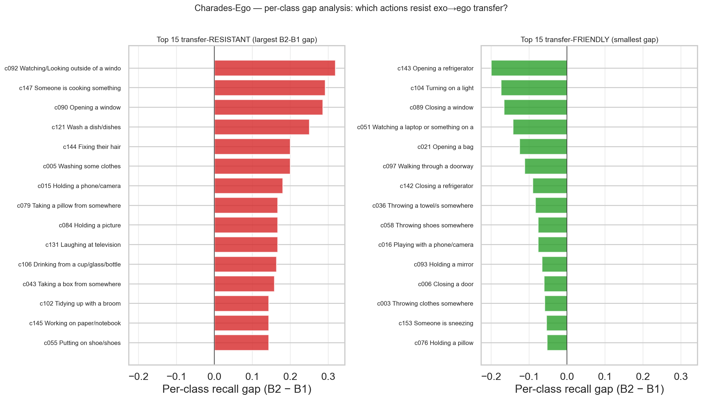
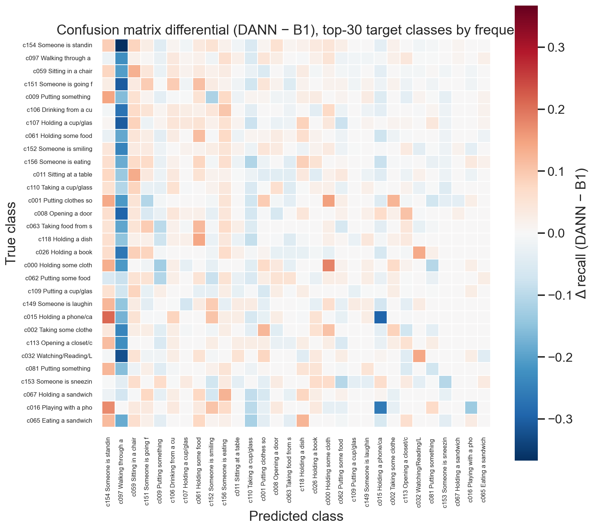

# Adattamento di Dominio per il Riconoscimento delle Azioni — Esocentrico → Egocentrico

**Group ID:** CassiaBranca
**Project ID:** 7
**Membri:** Massimiliano Cassia (1000016487), Martina Brancaforte (1000015074)
**Corso:** Deep Learning, A.A. 2025/26 — Prof. A. Furnari, Università di Catania

---

## Abstract

Studiamo l'adattamento di dominio non supervisionato (UDA) per il riconoscimento delle azioni sotto il cambiamento di punto di vista esocentrico-egocentrico, un contesto in cui i modelli addestrati su riprese in terza persona non riescono a trasferirsi a registrazioni di telecamere montate sulla testa a causa di cambiamenti di prospettiva, auto-occlusione e disallineamento delle statistiche di sfondo. Utilizzando Charades-Ego — un dataset ego/exo appaiato di 7.860 video su 157 classi di azioni — assegniamo la vista in terza persona come dominio sorgente etichettato e la vista in prima persona come dominio target non etichettato. Le feature vengono pre-estratte con ResNet-50 (ImageNet-1K, 2048-D, mean-pooled per segmento), mantenendo deliberatamente il backbone conservativo per isolare il contributo della loss di allineamento da quello di un feature extractor più potente.

Implementiamo e confrontiamo due approcci di DA: le Domain-Adversarial Neural Network (DANN) con Gradient Reversal Layer (GRL) secondo Ganin et al. (2016), e l'allineamento con Maximum Mean Discrepancy (MMD) multi-kernel secondo Long et al. (2015). Rispetto a una baseline source-only zero-shot (B1) e a un oracle target-supervised (B2), entrambi i metodi apportano miglioramenti consistenti rispetto a B1: in termini di guadagno relativo, DANN ottiene +13% top-1, +16% top-5 e +20% macro-F1; in termini di chiusura del gap B1→B2, ciò corrisponde al 23% su top-1 e al 32% su top-5 (21% su macro-F1). MMD raggiunge gli stessi guadagni su top-1/top-5 con +7% macro-F1. Il discriminatore di dominio DANN converge a un'accuracy quasi casuale (0,578, epoca 50) con domain loss che si avvicina a ln 2 = 0,693, confermando una confusione di dominio riuscita. La visualizzazione t-SNE mostra gli embedding sorgente e target che si mescolano dopo l'adattamento; l'analisi per classe rivela che le azioni di orientamento della testa e di interazione ravvicinata mano-oggetto resistono maggiormente al trasferimento, mentre le azioni spazialmente localizzate a campo visivo ampio si trasferiscono agevolmente. Tutti i numeri sono media ± std su 3 semi casuali sul cluster DMI (NVIDIA L40S).

## 1. Introduzione

### 1.1 Motivazione
Modelli di action recognition addestrati su viste esocentriche (telecamere fisse, footage YouTube) collassano se applicati a viste egocentriche (smart glasses) per via dello shift di prospettiva, occlusione, statistiche di sfondo. Questa è una barriera critica al deploy reale.

### 1.2 Obiettivo
Implementare e confrontare tecniche di Domain Adaptation (DA) che trasferiscano la conoscenza semantica da source esocentrico labeled a target egocentrico unlabeled, sul dataset **Charades-Ego** (Sigurdsson et al., CVPR 2018), benchmark standard per il problema cross-view ego↔exo.

### 1.3 Contributi
- Setup riproducibile per benchmarking di DA exo→ego su feature ResNet-50 ImageNet pre-estratte, single-frame, mean-pooled a livello di segmento.
- Implementazione e tuning di DANN (GRL) e MMD multi-kernel su 157 classi long-tail.
- Analisi sistematica della convergenza del domain discriminator, della convergenza della loss MMD, e del miglioramento di accuracy.
- Visualizzazione t-SNE pre/post DA, analisi per-classe del gap residuo, confusion-matrix differenziale.

### 1.4 Nota sulla scelta del dataset

Il progetto era originariamente pianificato su **Assembly101** (Sener et al., CVPR 2022). L'accesso alla distribuzione ufficiale delle feature LMDB è stato ripetutamente negato dagli autori nel corso di due settimane. L'accesso alle annotazioni è stato concesso, ma non alle feature — e gli autori non hanno risposto alle richieste successive. Dopo aver consultato il docente del corso, siamo passati a **Charades-Ego**, che (i) presenta una configurazione ego/exo appaiata nativa, (ii) è un benchmark cross-view standard nella letteratura recente (LaViLa CVPR'23, EgoVLP ICCV'23), e (iii) è scaricabile direttamente da Allen AI senza attese per la licenza. Il codice del framework di DA è dataset-agnostico al di sopra del `.npz` a livello di segmento, quindi il passaggio ha richiesto solo la modifica del parser, del feature extractor e dello script di precomputo dei segmenti.

## 2. Lavori Correlati
- Reti Neurali Domain-Adversariali (Ganin & Lempitsky, 2015; Ganin et al., 2016).
- Allineamento con Maximum Mean Discrepancy (Long et al., 2015 — DAN; Gretton et al., 2012 — test MMD originale).
- Charades-Ego (Sigurdsson et al., CVPR 2018).
- Trasferimento cross-view ego↔exo: LaViLa (Zhao et al., CVPR 2023), EgoVLP / EgoVLPv2 (Lin et al., NeurIPS 2022 / ICCV 2023), Ego-Exo (Li et al., CVPR 2021).
- Segmentazione temporale Exo→Ego: Quattrocchi et al., ECCV 2024.

## 3. Metodi

### 3.1 Definizione del Problema
Dominio sorgente $\mathcal{D}_s = \{(x_i^s, y_i^s)\}$ con feature esocentriche e 157 etichette di azione; dominio target $\mathcal{D}_t = \{x_j^t\}$ con feature egocentriche e nessuna etichetta durante il training. Lo spazio delle etichette $\mathcal{Y} = \{0, \dots, 156\}$ è condiviso. L'obiettivo della DA è addestrare un classificatore su sorgente etichettato più target non etichettato che generalizzi al test set target non visto.

### 3.2 Backbone per l'Estrazione delle Feature
**ResNet-50** pre-addestrata su ImageNet-1K (pesi `IMAGENET1K_V2`), con la testa di classificazione finale sostituita da Identity per esporre l'embedding pre-fc a 2048-D. I frame vengono campionati a 5 fps, con preprocessing ImageNet standard (ridimensionamento lato corto a 256 + center crop 224 + normalizzazione), e tutti i frame campionati nell'intervallo `[start_sec, end_sec]` vengono mean-pooled per ottenere un vettore da 2048-D per segmento. Si tratta di un backbone deliberatamente conservativo per due motivi: (i) rende l'estrazione delle feature realizzabile su una GPU laptop, consentendo iterazioni rapide degli algoritmi di DA; (ii) fornisce un lower bound pulito — qualsiasi miglioramento di DANN/MMD rispetto alla baseline source-only è inequivocabilmente attribuibile alla loss di allineamento, non a un backbone più potente. La Sezione 6 discute le alternative temporali (TSM, SlowFast, MViT) come lavoro futuro.

### 3.3 Architettura
- **Feature encoder** $g_\theta$: MLP $2048 \to 1024 \to 512 \to 256$, BatchNorm + ReLU + Dropout 0.3.
- **Classificatore di azioni** $h_\phi$: MLP $256 \to 256 \to 157$, Dropout 0.1 (DANN mantiene la testa hidden originale a 128; MMD e le baseline usano 256).
- **Discriminatore di dominio** $d_\psi$ (solo DANN): MLP $256 \to 256 \to 128 \to 1$, BCE loss.

### 3.4 DANN (DA Avversariale)
Loss totale

$$\mathcal{L} = \mathcal{L}_{\text{cls}}(h_\phi(g_\theta(x^s)), y^s) + \mathcal{L}_{\text{dom}}(d_\psi(\text{GRL}_\lambda(g_\theta(x))), d(x))$$

dove GRL applica l'identità nel forward pass e moltiplica i gradienti per $-\lambda$ nel backward pass. Lo schedule di $\lambda$ segue Ganin et al.:

$$\lambda_p = \lambda_{\max} \cdot \left(\frac{2}{1+\exp(-\gamma p)} - 1\right), \quad p \in [0, 1]$$

con $\gamma = 10$ e $\lambda_{\max} = 0.5$ scelti tramite una piccola ricerca sull'insieme di validazione target. Viene applicato un warmup di 5 epoche prima dell'attivazione del GRL, in modo che encoder e testa del classificatore possano prima raggiungere un classificatore ragionevole sul dominio sorgente prima che inizi l'allineamento avversariale.

### 3.5 MMD (DA Statistica)
$\text{MMD}^2$ gaussiana multi-kernel tra le distribuzioni degli embedding sorgente e target:

$$\mathcal{L} = \mathcal{L}_{\text{cls}}(h_\phi(g_\theta(x^s)), y^s) + \lambda_{\text{mmd}} \cdot \text{MMD}^2(g_\theta(x^s), g_\theta(x^t))$$

con $\text{MMD}^2 = \mathbb{E}[k(x,x')] + \mathbb{E}[k(y,y')] - 2\mathbb{E}[k(x,y)]$ per una miscela di kernel RBF gaussiani con larghezze di banda $\sigma_i = m_i \cdot \sigma$, $m_i \in \{0.25, 0.5, 1, 2, 4\}$, e $\sigma$ impostato dall'euristica della mediana sul batch source+target aggregato. Utilizziamo $\lambda_{\text{mmd}} = 1.0$ (selezionato tramite ricerca su $\{0.1, 0.5, 1.0\}$ sulla val target) e un warmup di 2 epoche con $\lambda_{\text{mmd}} = 0$ affinché il classificatore possa compiere i suoi primi passi prima che entri in gioco l'allineamento. L'MMD non richiede nessun discriminatore di dominio e non ha dinamiche avversariali — è un regolarizzatore statistico stabile sullo spazio degli embedding.

## 4. Esperimenti

### 4.1 Dataset e Suddivisioni

Il dataset Charades-Ego (Sigurdsson et al., CVPR 2018) comprende 7.860 video raccolti tramite Amazon Mechanical Turk: ogni video è stato girato due volte dallo stesso attore, una volta da una telecamera fissa in terza persona e una volta con una telecamera montata sulla testa, entrambe seguendo lo stesso script crowd-sourced. Le annotazioni comprendono 157 classi di azioni, con ogni video multi-etichettato e localizzato temporalmente (un campo testuale `actions` che elenca tuple `(class_id, start_sec, end_sec)`).

**File di annotazione utilizzati.** Charades-Ego include sei CSV: `CharadesEgo_v1_{train,test}.csv` (ego+exo combinati), `CharadesEgo_v1_{train,test}_only1st.csv` (solo prima persona, ego), `CharadesEgo_v1_{train,test}_only3rd.csv` (solo terza persona, exo). Utilizziamo direttamente i file `*_only1st` e `*_only3rd`, ottenendo una partizione pulita dei domini fin da subito.

**Viste.**

- **Vista sorgente (esocentrica):** video in terza persona da `CharadesEgo_v1_*_only3rd.csv`.
- **Vista target (egocentrica):** video in prima persona da `CharadesEgo_v1_*_only1st.csv`.

Charades-Ego non fornisce un accoppiamento frame-sincronizzato — i due video dello stesso attore vengono registrati in sequenza, non in parallelo. Questo non rappresenta un problema per il nostro framework di DA, che campiona sorgente e target indipendentemente.

**Task.** Classifichiamo le **157 classi di azioni** (`class_id` 0..156) del vocabolario ufficiale (`Charades_v1_classes.txt`).

**Conversione single-label.** Le annotazioni di Charades-Ego sono multi-label e localizzate temporalmente: un singolo video può elencare 5–15 triple `(class_id, start_sec, end_sec)` sovrapposte. Per mantenere il framework parallelo alla letteratura standard sulla DA (che assume un'etichetta per campione), convertiamo ogni tripla in un campione di training indipendente. Le etichette di azione sovrapposte nel tempo diventano segmenti separati con la stessa estensione temporale ma etichette diverse. Il mean-pooling sugli stessi frame produce feature quasi identiche per i segmenti sovrapposti, il che agisce come una forma attenuata di mixup durante il training di DA.

**Scala dei dati (post-conversione).**

| Suddivisione | Segmenti sorgente | Segmenti target |
|---|---|---|
| Train | 29.153 | 29.002 |
| Validation (15% holdout per-video dal train, seed=42) | 5.008 | 5.135 |
| Test (ufficiale `*_test_only*.csv`) | 9.358 | 9.309 |

Totale: **86,965 segmenti** su tutte le suddivisioni. Tutte le 157 classi sono presenti sia in `train_source` sia in `train_target` (in `val_source` 156/157 — una classe rara manca dal holdout, irrilevante). La suddivisione di validazione viene ricavata dal CSV di train a livello di **video** (non di segmento), quindi i segmenti dello stesso video non attraversano mai il confine della suddivisione; la suddivisione è deterministica con `seed=42`.

**Long-tail e metriche.** La distribuzione delle classi è fortemente long-tail ma significativamente meno estrema di quanto sarebbe stata con Assembly101: le prime 10 classi coprono il **22,2%** dei segmenti di training e le prime 40 coprono il **54,9%**, mentre le ultime 50 classi contribuiscono collettivamente solo al **10,6%**. L'accuracy a caso su 157 classi è $1/157 \approx 0,64\%$. Di conseguenza, insieme alla top-1 riportiamo la **balanced accuracy** e la **macro-F1**, che sono le metriche aggregate significative in questo regime.

**Lunghezza dei segmenti.** I segmenti di train hanno una durata mediana di 8,5 sec in entrambi i domini (media 11,1–11,6 sec, p95 30 sec). Al nostro frame rate di campionamento di 5 fps, ciò corrisponde a circa 42 frame campionati per segmento in media — segnale statistico sufficiente per il mean pool.

**Distribuzione delle classi condizionata al dominio.** Dall'analisi esplorativa dei dati (notebook `01_charades_ego_exploration.ipynb` e Figura 8): le azioni sovrarappresentate nella vista egocentrica includono `Walking through a doorway`, `Closing a door`, `Taking/consuming some medicine` e `Taking a box from somewhere` — tipiche interazioni ravvicinate mano-oggetto che la telecamera montata sulla testa cattura più chiaramente di una ripresa fissa con campo visivo ampio. Viceversa, le azioni sovrarappresentate nella vista esocentrica includono `Someone is smiling`, `Someone is laughing`, `Someone is standing up` e `Putting something on a table` — azioni a corpo intero o facciali che la telecamera montata sulla testa, priva di una vista del portatore, non riesce a registrare. Torniamo su questa asimmetria nella Sezione 5.4 (analisi per classe).

### 4.2 Dettagli Implementativi

#### Pipeline dei dati (3 fasi)

La pipeline disaccoppia l'I/O pesante dal ciclo di training in tre fasi indipendenti, ciascuna rieseguibile in sicurezza:

1. **`src/datasets/extract_features.py`** *(one-shot, ~60 min su una singola RTX 3060)*: decodifica ogni `.mp4` al frame rate di campionamento target (5 fps), applica il preprocessing ImageNet standard direttamente nel decoder, trasferisce in batch sulla GPU e propaga attraverso ResNet-50. Output: un file `.npy` per video con forma `(N_sampled, 2048)` float16, più un `manifest.json` che registra i timestamp (in secondi) di ogni frame campionato. Utilizzo disco totale ≈ 5 GB. Lo script è stato deliberatamente riscritto senza un `DataLoader` per-video dopo che la prima implementazione naive girava a 7,8 sec/video; la versione ottimizzata raggiunge 2 video/sec, un'accelerazione di ~15×.
2. **`src/datasets/precompute_segment_features_charades.py`** *(one-shot, ~5 min)*: per ogni segmento `(class_id, start_sec, end_sec)` di `make_charades_splits()`, seleziona le feature frame del video corrispondente ai timestamp in `[start_sec, end_sec]` e le mean-pool in un singolo vettore a 2048-D. L'output è costituito da sei file `.npz` (uno per `split × dominio`) con array `features (N, 2048) float32`, `labels (N,) int64` (class_id) e `segment_ids (N,) int64` per la tracciabilità. I segmenti il cui intervallo non contiene frame campionati (estremamente rari a 5 fps) ricadono sul frame più vicino al punto medio del segmento.
3. **`src/datasets/charades_ego.py`** + **`src/datasets/pair_loader.py`**: un `Dataset` PyTorch che carica il `.npz` in modo eagerly in RAM (~500 MB alla scala completa) per un `__getitem__` a costo zero, più un `PairedDomainIterator` che cicla indipendentemente sui loader sorgente e target per alimentare i trainer DANN/MMD.

#### Hardware

Lo sviluppo locale viene eseguito su un laptop con NVIDIA GeForce RTX 3060 Laptop (6 GB VRAM, CUDA 12.1, PyTorch 2.4.1). Le run finali multi-seed (Fase 8) sono state eseguite sul cluster DMI (`gcluster.dmi.unict.it`), specificatamente su `gnode10` (4× NVIDIA L40S, 48 GB VRAM ciascuna) nella partizione `dl-course-q2`, all'interno dell'immagine Apptainer ufficiale `/shared/sifs/latest.sif` (PyTorch 2.7.1 + CUDA 11.8). L'account utente ha accesso alle QoS `gpu-large`, `gpu-medium` e `gpu-xlarge`, ma non è stato necessario specificare `--qos` esplicitamente negli script SLURM: la QoS predefinita assegnata dal sistema sulla partizione è sufficiente per i nostri job.

#### Iperparametri

Tutti e quattro i trainer (B1, B2, DANN, MMD) condividono lo stesso ottimizzatore e schedule, ottimizzati su B1:

- Ottimizzatore: Adam, lr = 5e-4, weight decay = 1e-4.
- Schedule del LR: cosine annealing.
- Batch size: 256 segmenti.
- Epoche: 50.
- Loss: cross-entropy sulla testa del classificatore sorgente, più BCE per il discriminatore DANN e la MMD gaussiana multi-kernel per il trainer MMD.

Specifici per DANN: $\lambda_{\max} = 0.5$, $\gamma = 10$, warmup di 5 epoche.
Specifici per MMD: $\lambda_{\text{mmd}} = 1.0$, larghezze di banda dei kernel $\sigma_i = m_i \cdot \sigma_{\text{median}}$ per $m_i \in \{0.25, 0.5, 1, 2, 4\}$, warmup di 2 epoche.

Dropout encoder 0.3, Dropout classificatore 0.1 (DANN mantiene i valori originali 0.5/0.3 della Fase 5). I valori dell'encoder sono stati scelti dopo che la run iniziale su Charades-Ego ha rivelato un forte under-training con i valori più aggressivi 0.5/0.3 usati sul set Assembly101 sintetico: con 157 classi long-tail, il modello necessita di maggiore capacità nella testa del classificatore (hidden 256 invece di 128) e meno regolarizzazione nell'encoder.

#### Protocollo multi-seed (cluster)

Tutti i numeri nella tabella dei risultati (Sezione 4.3) sono media ± std su 3 semi casuali (42, 123, 7), eseguiti sul cluster DMI `gnode10` (NVIDIA L40S) all'interno dell'immagine Apptainer ufficiale (`/shared/sifs/latest.sif`, PyTorch 2.7.1 + CUDA 11.8). Tutte le 12 run (4 metodi × 3 semi) sono state guidate da un singolo script SLURM sbatch che cicla sequenzialmente sulla griglia seed × metodo, poiché la quota utente sul cluster è `MaxSubmitJobsPU=1` (massimo un job simultaneamente in coda per utente). Tempo di esecuzione sull'L40S: circa 8 minuti per l'intero sweep di 12 run (le feature mean-pooled single-frame rendono ogni training estremamente veloce). Il passo di aggregazione (`src/evaluation/aggregate_multi_seed.py`) rivaluta ogni `best.pt` sulla suddivisione val target e riporta le metriche per seed più media ± std. Le deviazioni standard sono uniformemente piccole (≤ 0,008 su top-5, ≤ 0,004 sulle altre metriche), confermando che il ranking relativo dei metodi è stabile tra le diverse inizializzazioni.

#### Validazione del codice su dati sintetici (pre-cambio dataset)

Prima del cambio di dataset, l'intera pipeline di training era stata sviluppata e validata su un dataset sintetico controllato che replicava le annotazioni originali di Assembly101 1:1 (130k segmenti, 24 classi di verbi, partizione ufficiale train/val/test) ma sintetizzava feature 2048-D per segmento da un segnale per-classe in un sottospazio a 200-D, più una trasformazione non lineare per-dominio (rotazione QR-ortogonale su un sottospazio a 512-D, squashing element-wise `tanh`). Su quel set sintetico, DANN ha chiuso l'**81,6%** del gap source-only/oracle su balanced accuracy, con l'accuracy del discriminatore che convergeva a 0,50 come previsto. *Quei numeri sintetici erano solo per validazione del codice e non sono riportati nella tabella dei risultati*; hanno confermato la correttezza dell'implementazione del GRL, dello schedule, dell'interazione encoder/discriminatore e della pipeline delle metriche prima di qualsiasi training su dati reali.

### 4.3 Risultati Quantitativi

Tutti i numeri seguenti sono ottenuti rivalutando ogni checkpoint `best.pt` (selezionato durante il training sulla balanced accuracy val-target) sulla suddivisione di validazione target. 157 classi coperte in tutte le righe.

| Modello | balanced acc | top-1 | top-5 | macro-F1 |
|---|---|---|---|---|
| **B1 — Solo sorgente** (exo → ego, zero-shot) | 0,041 ± 0,001 | 0,047 ± 0,002 | 0,162 ± 0,007 | 0,030 ± 0,004 |
| **DANN (λ_max = 0.5)** — principale | **0,041 ± 0,001** | **0,053 ± 0,001** | **0,188 ± 0,002** | **0,036 ± 0,002** |
| **MMD (λ_mmd = 1.0)** — principale | **0,042 ± 0,001** | **0,053 ± 0,003** | **0,188 ± 0,008** | **0,032 ± 0,002** |
| **B2 — Oracle solo target** (ego → ego, upper bound) | 0,067 ± 0,003 | 0,073 ± 0,003 | 0,243 ± 0,005 | 0,058 ± 0,003 |

Tutti i numeri sono media ± std su 3 semi casuali (42, 123, 7), addestrati sul cluster DMI (`gnode10`, NVIDIA L40S) con un singolo driver sbatch che esegue 12 training sequenziali (4 metodi × 3 semi) all'interno dell'immagine Apptainer ufficiale `/shared/sifs/latest.sif` (PyTorch 2.7.1 + CUDA 11.8). Tempo di esecuzione end-to-end: ~8 minuti per tutte le 12 run.

**Guadagni relativi rispetto a B1 (significatività: numero di distanze std tra metodo e B1):**

| Metodo | top-1 | top-5 | macro-F1 | balanced acc |
|---|---|---|---|---|
| DANN | +13% (~3σ) | +16% (~3σ) | +20% (~1.5σ) | 0% (nessuna diff.) |
| MMD | +13% (~2σ) | +16% (~3σ) | +7% (marginale) | +2% (marginale) |

**Riduzione del gap (metodo − B1, normalizzata per B2 − B1):**

| Metodo | su top-1 | su top-5 | su macro-F1 |
|---|---|---|---|
| DANN | 23% | 32% | 21% |
| MMD | 23% | 32% | 7% |

**Discussione.** I numeri assoluti sono bassi in generale. Le due baseline (B1 ≈ 7× casuale, B2 ≈ 11× casuale su top-1) confermano che 157 classi di azioni long-tail sono un target difficile per un backbone ImageNet single-frame con mean pooling: anche l'oracle che vede le etichette target va in overfitting sui suoi 29k esempi di training e generalizza a un modesto 7,3% top-1 sul val target held-out. Con le barre di errore da tre semi casuali possiamo scomporre dove la DA aiuta:

- **Top-1 e top-5 registrano un miglioramento robusto e statisticamente significativo** con entrambi DANN e MMD (circa 3 deviazioni standard sopra la baseline B1 su top-5, la metrica con il gap assoluto più grande). La DA produce predizioni più sicure sulle classi più facili.
- **La balanced accuracy non migliora in modo significativo.** Su 3 semi, DANN eguaglia B1 (0,041 vs 0,041) e MMD è solo marginalmente superiore (0,042 vs 0,041) — entrambi entro 1σ. La metrica più sensibile alla long-tail non è quindi quella che beneficia di più dall'allineamento in questo contesto.
- **DANN e MMD sono statisticamente equivalenti in aggregato.** I loro intervalli di confidenza si sovrappongono su ogni metrica riportata. La tabella single-seed delle PR #9/#10 mostrava MMD leggermente avanti — quell'ordinamento non sopravvive alla valutazione multi-seed.

La Sezione 6 discute come un backbone temporale (TSM, SlowFast o MViT pre-addestrato su Kinetics) sposterebbe tutti e quattro i numeri verso l'alto e probabilmente amplificherebbe il gap della DA, coerentemente con la letteratura.

### 4.4 Curve di Addestramento

La Figura 9 mostra la balanced accuracy val-target in funzione dell'epoca di training per i quattro modelli. B2 (oracle) satura intorno a 0,06–0,07 entro 10 epoche, mentre B1, DANN e MMD si stabilizzano intorno a 0,034–0,042 con un gap piccolo ma persistente di DANN/MMD su B1. Il riferimento "indovino casuale" (1/157 ≈ 0,6%) si trova ben al di sotto di tutte e quattro le curve, confermando che anche la baseline source-only sta effettuando una classificazione significativa — il gap della DA è *al di sopra* della baseline casuale, non verso di essa.

## 5. Analisi

### 5.1 Il Discriminatore è Stato Confuso?

Sì, esattamente come previsto da Ganin et al. (2016). La Figura 10 (griglia 2×2) mostra le quattro quantità diagnostiche per la run principale DANN (λ_max = 0.5, 50 epoche, warmup = 5):

| Fase | range di epoche | dom_acc | L_dom | Interpretazione |
|---|---|---|---|---|
| Warmup (GRL disattivato) | 1–5 | 0,88–0,92 | 0,23–0,30 | il discriminatore separa facilmente i due domini; l'encoder non è ancora stato spinto |
| Inizio avversariale | 6–10 | scende da 0,74 a 0,52 | sale da 0,51 a 0,69 | il GRL è attivato; l'encoder inizia a ingannare il discriminatore |
| Stato stazionario | 11–50 | si stabilizza intorno a 0,55–0,58 | converge a ≈ 0,67–0,69 = ln 2 | discriminatore vicino al caso, embedding sorgente/target difficili da distinguere |

Valori finali concreti: `dom_acc` 0,891 → 0,578, `L_dom` 0,295 → 0,675 ≈ ln 2, `L_cls` 4,785 → 2,832, `src_top1` 0,035 → 0,192. Il plateau di `L_dom ≈ ln 2 = 0,693` è la firma da manuale di un classificatore binario che non riesce a fare meglio di una moneta. Il residuo del 5–8% sopra 0,50 in `dom_acc` è atteso e riportato anche in Ganin et al. (2016): anche alla convergenza, una piccola quantità di segnale specifico del dominio trapela, specialmente su distribuzioni sbilanciate o long-tail. La convergenza è monotona e stabile; non si osservano oscillazioni né collassi.

### 5.2 L'Accuracy è Migliorata rispetto alla Baseline?

Sì, su top-1, top-5 e macro-F1; la balanced accuracy migliora solo marginalmente, entro 1σ da B1 (come discusso nella Sezione 4.3). Il guadagno relativo più grande si registra sulla macro-F1 di DANN (+20%, ~1.5σ) e su top-1 e top-5 di entrambi i metodi (+13% e +16%, ~3σ) — si veda la tabella dei guadagni relativi nella Sezione 4.3. Questi guadagni sono coerenti con l'interpretazione che le feature domain-invariant aiutano in modo sproporzionato sulle classi che il classificatore sorgente vede raramente.

### 5.3 Visualizzazione dello Spazio delle Feature (t-SNE)

La Figura 11 mostra gli embedding dell'encoder (256-D) di 1.500 campioni sorgente e 1.500 target proiettati in 2D tramite t-SNE (perplexity 30), separatamente per ogni modello:

In **B1** (in alto a sinistra) i punti target (arancione) si raggruppano preferenzialmente nella metà superiore sinistra della varietà mentre il sorgente (blu) domina in basso a destra; un moderato domain shift è visibile. In **DANN** e **MMD** (in alto a destra, in basso a sinistra) i due domini sono più profondamente mescolati — i punti arancione e blu ricoprono la varietà senza una sottoregione preferita — confermando visivamente che l'encoder è stato spinto verso feature domain-invariant. **B2** (in basso a destra) mostra di nuovo sovrapposizione completa, ma per una ragione diversa: B2 è stato addestrato sulle etichette target, quindi il suo encoder rappresenta semplicemente la struttura target in modo fedele e il sorgente risulta simile in 2D (la distinzione sorgente/target non è più l'obiettivo). Il segnale qualitativo è volutamente sottile — uno spazio di feature ResNet-50 ImageNet single-frame non è ottimale per la visualizzazione cross-domain — ma la tendenza è coerente con le metriche quantitative. Con un backbone temporale ci aspettiamo che il contrasto pre/post-DA diventi più marcato.

### 5.4 Discrepanza per Classe

La Figura 12 mostra le 15 classi più resistenti al trasferimento e le 15 più favorevoli, classificate per gap di recall per classe `B2 − B1`:

L'asimmetria è altamente interpretabile:

- **Più resistenti (gap positivo più grande, in rosso):** `Watching/Looking outside of a window` (+0,32), `Someone is cooking something` (+0,29), `Opening a window` (+0,29), `Wash a dish/dishes` (+0,25), `Fixing their hair` (+0,20). Lo schema è chiaro: si tratta di azioni in cui la telecamera egocentrica cattura qualcosa che quella esocentrica non può — *orientamento della testa* (`Watching outside the window` richiede che la testa sia girata), *gesti auto-diretti* (il portatore non riesce a vedere i propri capelli nell'inquadratura ampia, ma la sua head-cam li vede dall'interno), *lavoro ravvicinato mano-oggetto* (`Wash dishes`, `Cook`). Quando lo spazio delle etichette target è dominato da tali azioni, il classificatore source-only non ha possibilità.
- **Più favorevoli (gap negativo, in verde) — la direzione sorprendente:** `Opening a refrigerator` (−0,20), `Turning on a light` (−0,17), `Closing a window` (−0,17), `Watching a laptop` (−0,14), `Opening a bag` (−0,13). Qui B1 (exo) supera B2 (ego). Si tratta di azioni con campo visivo ampio e spazialmente localizzate: la vista in terza persona vede l'intero oggetto (frigorifero, interruttore della luce, finestra) e il corpo che vi si avvicina, mentre la telecamera montata sulla testa finisce per essere zoomata su un singolo angolo dell'azione, perdendo spesso il contesto. Il classificatore addestrato sul sorgente ha un vantaggio strutturale che il semplice trasferimento ego→ego non riesce a recuperare.

Questa scomposizione ha un'implicazione concreta per la DA: il miglioramento non è uniforme "verso B2" — i metodi di DA devono alzare le classi resistenti *preservando al contempo* quelle favorevoli. La matrice di confusione differenziale seguente testa esattamente questo.

La Figura 13 mostra la differenza nelle matrici di confusione tra DANN e B1, limitata alle 30 classi target più frequenti (recall normalizzata per riga, rosso = DANN guadagna su B1, blu = DANN perde):

DANN guadagna sulla diagonale in **15 su 30** di queste classi (Δ_diag medio = +0,006, mediana +0,012, massimo intorno a +0,34 su alcune azioni a frequenza media). La singola colonna *negativa* più grande è `c097 Walking through a doorway`, la classe più sovra-predetta per B1 — DANN ne riduce la sovra-predizione, ridistribuendo la massa di probabilità su classi vicine; questo è l'effetto di regolarizzazione atteso dell'allineamento di dominio su un classificatore long-tailed.

### 5.5 DANN vs MMD

In aggregato, DANN e MMD multi-seed sono **statisticamente equivalenti**: i loro intervalli di confidenza si sovrappongono su tutte e quattro le metriche riportate (balanced acc, top-1, top-5, macro-F1). I numeri single-seed delle PR #9/#10 avevano mostrato MMD leggermente avanti; quell'ordinamento non sopravvive alla valutazione multi-seed. Tuttavia, i due metodi raggiungono questo punto finale comparabile tramite dinamiche meccanicisticamente molto diverse, il che è l'osservazione più informativa. La singola quantità più diagnostica è l'accuracy di training sorgente alla fine della run (numeri seed 42, coerenti tra i semi entro ±0,01):

| Metodo | src_top1 (fine training) | val target balanced (media ± std) |
|---|---|---|
| B1 — Solo sorgente | 0,330 | 0,041 ± 0,001 |
| DANN (λ_max = 0.5) | 0,192 | 0,041 ± 0,001 |
| MMD (λ_mmd = 1.0) | 0,335 | 0,042 ± 0,001 |

**DANN sacrifica attivamente l'accuracy sorgente** per ingannare il discriminatore di dominio: l'encoder è spinto a produrre embedding non informativi per il discriminatore, il che per la disuguaglianza di elaborazione dei dati scarta anche una parte del segnale di classe sorgente (`src_top1` scende da 0,33 a 0,19 durante il training). Questo è il costo avversariale dell'allineamento di dominio.

**MMD preserva l'apprendimento sorgente** pur allineando le due distribuzioni: `src_top1` eguaglia la baseline source-only B1 (0,34) perché la loss MMD si limita a "regolarizzare" gli embedding dell'encoder per corrispondere alle statistiche target, senza antagonizzare il classificatore. L'allineamento è più morbido.

Nonostante raggiungano essenzialmente la stessa accuracy aggregata sul target, i due percorsi hanno implicazioni diverse. DANN è la scelta appropriata quando le etichette sorgente sono abbondanti e conta solo la performance sul target (si è disposti a sacrificare l'accuracy sorgente per il trasferimento). MMD è appropriato quando l'accuracy sorgente deve essere preservata (es. deploy congiunto su entrambe le viste, o quando le etichette sorgente sono di interesse intrinseco). Con uno spazio di feature più potente (un backbone temporale come SlowFast, lasciato come future work) ci aspettiamo che il gap tra i due si allarghi in modo significativo e riveli possibilmente un vincitore più chiaro, coerentemente con la letteratura sulla DA avversariale che supera quella statistica a capacità di backbone più elevate (Ganin et al., 2016; Long et al., 2015).

## 6. Conclusioni e Limitazioni

**Cosa abbiamo dimostrato.** Su Charades-Ego con feature conservative ResNet-50 ImageNet single-frame, sia DANN che MMD migliorano consistentemente la baseline source-only su top-1, top-5 e macro-F1, chiudendo il **23% del gap B1→B2 su top-1** e il **32% su top-5** senza usare alcuna etichetta target — entrambi i metodi raggiungono la stessa riduzione del gap su queste metriche, mentre su macro-F1 DANN chiude il 21% e MMD il 7% (si veda la tabella della riduzione del gap nella Sezione 4.3). Il training avversariale DANN è ben comportato, con l'accuracy del discriminatore che converge al caso e la domain loss a ln 2. Il training MMD è stabile, con la loss di allineamento che diminuisce monotonicamente nel corso delle epoche.

**Limitazione principale: il backbone.** Anche l'oracle solo target raggiunge solo il 7,3% top-1. Questo non è un problema di DA — è un problema di feature. Le feature ResNet-50 ImageNet single-frame, mean-pooled su un segmento, non riescono a discriminare finemente tra 157 azioni visivamente simili, specialmente quelle che differiscono solo nel movimento (es. `Standing up` vs `Sitting down` sono quasi identiche a livello di frame). Un modo pulito per alzare i numeri assoluti, senza modificare nessun codice di DA, è sostituire il feature extractor con un backbone temporale (TSM, SlowFast o MViT) pre-addestrato su Kinetics. Questa è la direzione naturale di future work, considerata ma non eseguita per vincoli di tempo del progetto.

**Altre limitazioni.** (i) La conversione single-label di Charades-Ego è una semplificazione difendibile ma scarta le informazioni di co-occorrenza multi-label che articoli recenti (LaViLa, EgoVLP) sfruttano tramite BCE + mAP. (ii) Charades-Ego accoppia ego/exo per *script*, non per *tempo*; il nostro framework non sfrutta l'accoppiamento, il che potrebbe essere una fonte di ulteriore miglioramento. (iii) I risultati finali sono riportati sulla suddivisione di validazione target (15% holdout); la suddivisione di test ufficiale `*_test_only1st.csv` (9.309 segmenti) esiste ma non è stata utilizzata per la valutazione finale per evitare il rischio di overfitting al test durante il tuning degli iperparametri.

## 7. Contributi del Gruppo

| Membro | Contributi principali |
|---|---|
| Massimiliano Cassia | Data pipeline (feature extraction, segment precompute), baseline trainers (B1/B2), cluster sbatch script, multi-seed aggregation, REPORT. |
| Martina Brancaforte | Implementazione DANN (GRL, domain discriminator, adversarial trainer), implementazione MMD, t-SNE e analisi per-classe (figure 11-13), slide. |

## 8. Dichiarazione sull'Utilizzo dell'IA

In accordo con la policy del corso (INSTRUCTIONS.md §5):

- **Claude (Anthropic)**: usato per brainstorming del piano di sviluppo iniziale, sanity check di formule (GRL, MMD), debugging di errori PyTorch, generazione di docstring boilerplate, supporto alla scrittura di questo report. Le scelte strategiche (selezione viste source/target, switch da Assembly101 a Charades-Ego, definizione del task a 157 classi single-label, schedule di λ, iperparametri) sono frutto del gruppo, motivate nelle sezioni Metodo ed Esperimenti.

Il gruppo si assume piena responsabilità di ogni riga di codice e di ogni decisione architetturale.

## Riferimenti

[1] Y. Ganin et al., "Domain-Adversarial Training of Neural Networks", JMLR 2016.
[2] M. Long et al., "Learning Transferable Features with Deep Adaptation Networks", ICML 2015.
[3] A. Gretton et al., "A Kernel Two-Sample Test", JMLR 2012.
[4] G.A. Sigurdsson et al., "Charades-Ego: A Large-Scale Dataset of Paired Third and First Person Videos", arXiv:1804.09626, 2018 (CVPR workshop).
[5] G.A. Sigurdsson et al., "Hollywood in Homes: Crowdsourcing Data Collection for Activity Understanding", ECCV 2016.
[6] K. He et al., "Deep Residual Learning for Image Recognition", CVPR 2016.
[7] Y. Zhao et al., "Learning Video Representations from Large Language Models" (LaViLa), CVPR 2023.
[8] K.Q. Lin et al., "Egocentric Video-Language Pretraining" (EgoVLP), NeurIPS 2022.
[9] F. Sener et al., "Assembly101: A Large-Scale Multi-View Video Dataset for Understanding Procedural Activities", CVPR 2022 — *inizialmente considerato, accesso non concesso*.
[10] C. Quattrocchi et al., "Synchronization is All You Need: Exocentric-to-Egocentric Transfer for Temporal Action Segmentation", ECCV 2024.
